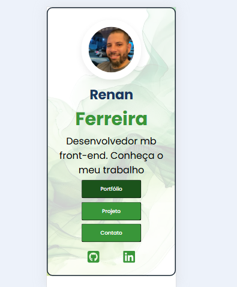

🚀 *Portfólio Front-End | Renan Ferreira*  
URL do Projeto: (https://zerogallo.github.io/Pagina-perf/)

  

# *Objetivo*  
Desenvolver um *site pessoal/portfólio* para exibir habilidades e projetos em front-end, integrando experiências técnicas e interatividade. O projeto visa:  
- Demonstrar competências em desenvolvimento web responsivo.  
- Conectar redes sociais e plataformas profissionais (LinkedIn, YouTube, WhatsApp).  
- Explorar a intersecção entre front-end e ciência de dados (seção Cientista).  

---

### *Tecnologias e Recursos*  
🛠️ *Stack Principal:*  
- HTML5 | CSS3 | JavaScript (em planejamento).  
- GitHub Pages para hospedagem estática.  

📱 *Design:*  
- Layout responsivo, otimizado para dispositivos móveis (ex: iPhone 14 Pro Max).  
- Navegação simplificada com seções: Portfolio, Projetos, Cientista.  

🔗 *Integrações:*  
- Links diretos para redes sociais e ferramentas profissionais.  
- Experimentos com componentes dinâmicos (ex: seção "FX").  

#   Visual Studio Code 

  

